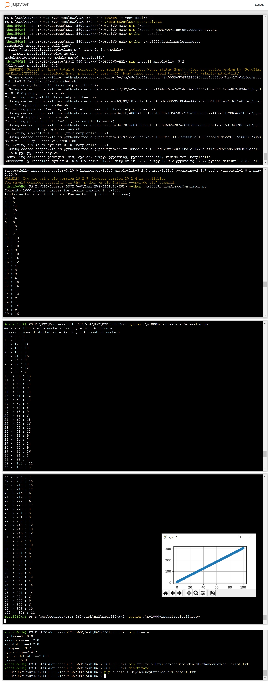
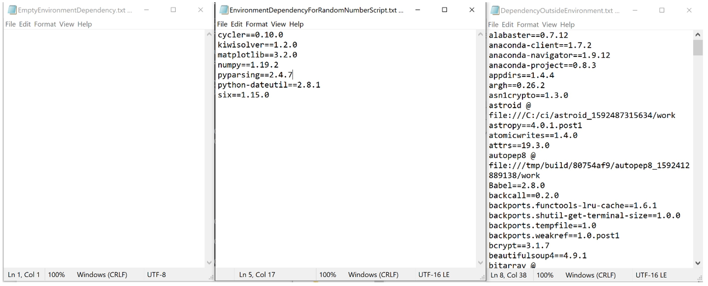

# DSCI560-HW2

A Binder-compatible repo with a requirements.txt file.

Access this Binder tree at the following URL:

[](https://mybinder.org/v2/gh/nandrian-usc/DSCI560-HW2/master)


Or access notebook directly at the following URL:

[](https://mybinder.org/v2/gh/nandrian-usc/DSCI560-HW2/master?filepath=1000RandomNumberPlot.ipynb)


The requirements.txt file list all Python libraries that the notebooks depend on, and they will be installed using:

```
pip install -r requirements.txt
```


# PROJECT DESCRIPTION


A simple project for Data Science Practicum (DSCI 560). Task:

1. Generating 1000 random number for x axis ranging from 0-100

2. Generating 1000 number for y-axis using y= 3x + 6 formula

3. Visualize x and y using plot line


Link to Jupyter notebook file https://github.com/nandrian-usc/DSCI560-HW2/blob/master/1000RandomNumberPlot.ipynb

Link to data on Figshare:

1. 1000_x-axis_random_number_ranging_0_to_100 data: https://doi.org/10.6084/m9.figshare.12978962.v1
2. 1000_y-axis_number_by_3x_plus_6 data: https://doi.org/10.6084/m9.figshare.12978959.v1
3. lineplot_random_x_and_3xPlus6_y plot: https://doi.org/10.6084/m9.figshare.12978965.v1

DOI on Zenodo: <a href="https://zenodo.org/badge/latestdoi/296775003"></a>


# INSTRUCTION

## Q1. Create empty environment named dsci560H4.

i. Copy this github URL and clone to local repository by executing in command line:

```
git clone https://github.com/nandrian-usc/DSCI560-HW2.git
```

Note: This project was executed using python 3.8.3 version.

ii. If not already installed, do pip installation of virtualenv package. Open command prompt/Jupyter terminal in Windows OS and run:

```
pip install virtualenv
```

iii. Go to project folder (DSCI560-HW2) and create new empty environment named dsci560H4 by running:

```
python -m venv dsci560env
``` 


## Q2. Activate environment of dsci560H4 and installed necessary package to run random number script.

i. Activate environment by running:

```
.\dsci560H4\Script\activate
```

ii. Ensure that "(dsci560H4)" appeared in the left side of command prompt line. 

iii. Check existing dependency of empty environment by running: (this should show empty)

```
pip freeze
```

or to download, run:

```
pip freeze > EmptyEnvironmentDependency.txt
```

iv. Check for python version by running:

```
python --version
```

v. (Check that random script need extra library other than basic python package) Install Matplotlib (version 3.2 was the most stable for python 3.8) to generate plot line visualization by running:

```
pip install matplotlib==3.2
```

or by using requirement.txt from git clone, run:

```
pip install -r requirements.txt
```
 

vi. Check that all random number script can be executed using newly environment (with matplotlib installed)

```
python x1000RandomNumberGenerator.py
```

```
python y1000FormulaNumberGenerator.py
```

```
python xy1000VisualizePlotline.py
```

## Q3. Take screenshot of the terminal by using normal print screen function on keyboard.




## Q4. Extract dependency of dsci560H4 environment

### a. Steps in order to compare between environment dependency: (screenshot in Q3 above)
i. (Empty dependency already generated in step Q2.iii above) Check dependency for new environment (which can execute random number script savely) by running:

```
pip freeze
```

or to download, run:

```
pip freeze > EnvironmentDependencyForRandomNumberScript.txt
```

Note: later this EnvironmentDependencyForRandomNumberScript.txt should be renamed requirements.txt in step Q4.c below so that it executable by Binder, but for comparison purpose it will be left with current name for now. Other way than renaming, we can also just generate requirements.txt dependency file by:

```
pip freeze > requirements.txt
```

ii. Deactivate dsci560H4 environment by running: 

```
deactivate
```

iii. Ensure that (dsci560H4) already disappeared from left part of command line. Compare dependency outside of dsci560H4 environment by running:

```
pip freeze > DependencyOutsideEnvironment.txt
```

iv. Compare the content of EmptyEnvironmentDependency.txt, EnvironmentDependencyForRandomNumberScript.txt, DependencyOutsideEnvironment.txt to see the difference




Comparison:

•	Empty environment of dsci560H4 has nothing inside its pip freeze environment file (EmptyEnvironmentDependency.txt) but if we do "python --version" in the console then it would show that Python 3.8.3 already installed.

•	To execute Random Number scripts from Homework 2, we only need python standard library, except for visualizing the graph where matplotlib would be needed. After manual pip install matplotlib, the new pip freeze environment file show several dependency as shown in picture. Other depedencies other than matplotlib were also installed, they are part of matplotlib dependencies.

•	The dsci560H4 environment stands alone from outside global environment. After deactivating the dsci560H4 environment and done another pip freeze environment (DependencyOutsideEnvironment.txt), we can see that it has more packages installed in the past.


### b. Exclude dsci560H4 environment folder from github commit. Add new file in DSCI560-HW2 folder and name it ".gitignore". Edit in notepad, write, and save:

```
dsci560H4
1000_x-axis_random_number_ranging_0_to_100.csv
1000_y-axis_number_by_3x_plus_6.csv
lineplot_random_x_and_3xPlus6_y.png
```

The last 3 lines is to exclude data so that it will not be uploaded to github (since data should be kept in Figshare instead).

### c. To operate in Binder, dependency requirement should be named requirements.txt. But for comparison purpose, EnvironmentDependencyForRandomNumberScript.txt will not be renamed into requirements.txt, instead, make another copy of EnvironmentDependencyForRandomNumberScript.txt and renamed it as requirements.txt.


## Q5. Update source code so that can be run on Binder.

i. Update script (x1000RandomNumberGenerator.py, y1000FormulaNumberGenerator.py, and xy1000VisualizePlotline) to output initial, intermediate, and final visualization in 1000RandomNumberPlot.ipynb notebook.

ii. Commit files to Github repository (check that all files/folder listed in .gitignore were not commited)

iii. Open <a href="https://mybinder.org/">Binder</a>

iv. On "Github repository name or URL" field, insert this repository address "https://github.com/nandrian-usc/DSCI560-HW2"

v. On "Git branch, tag, or commit" field, insert "master"

vi. On "Path to a notebook file (optional)" field, insert "1000RandomNumberPlot.ipynb"

vii. Get Binder badge by expanding "Copy the text below, then paste into your README to show a binder badge:" and copy the path in "m" (markdown) snippet. Copy the path and keep it temporary in notepad.

viii. Click launch, wait until installation of requirements.txt dependency complete and try to execute all cell in 1000RandomNumberPlot.ipynb notebook.


## Q6. Create instruction in README.md file

### a. How to setup virtual environment and execute it was described in Q1 - Q2 steps above and when finished, run deactivate.

```
deactivate
```


### b. Adding Binder project was already described in Q5 steps. Using badge path from step Q5.vii, copy and paste the path inside README.md file. Badge available at the top of this README file.